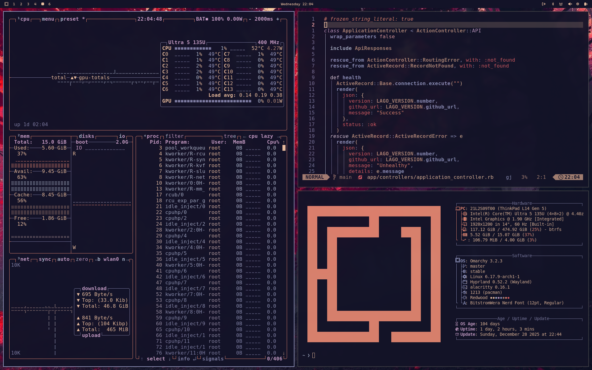
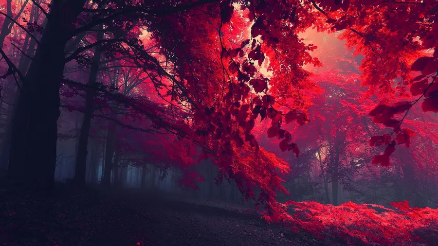

# Red Wood Theme for Omarchy

The theme combines cool violet undertones in the background with warm, woody red and pink tones in the accents. The gradients typically transition from cooler blue-gray tones to warmer coral and pink tones – fitting the name "Red Wood".

Screenshot: Hyprland with custom borders, Waybar, Ghostty terminal, and Neovim in action.

The theme is based on [this image](https://wallpapers.com/wallpapers/red-tree-gz3t2tpxv27u9ykq.html) and created using [Tēma](https://github.com/bjarneo/tema).

